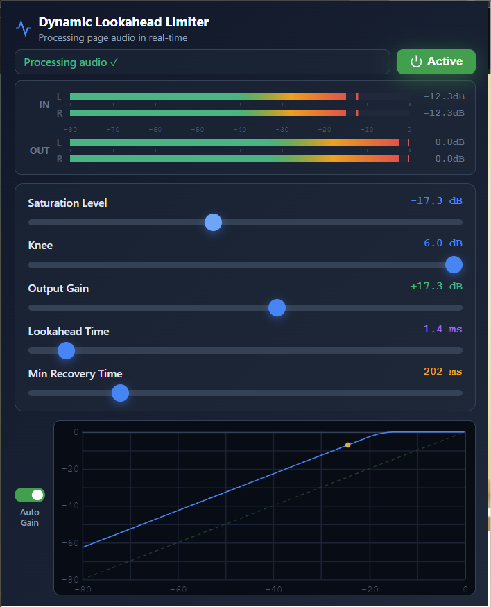

# Dynamic Lookahead Limiter — Chrome Extension

A sample-accurate audio limiter for web pages, built on the AudioWorklet API. Processes all page audio in real-time with adaptive spectral-aware recovery.



## Architecture

```
source -> inputAnalyser -> AudioWorkletNode -> destination
           (spectral,       (per-sample: envelope,
            main thread)     lookahead, gain, metering)
```

- **AudioWorkletProcessor** (`limiter-worklet.js`): runs on the audio thread — ring buffer lookahead delay, per-sample envelope follower (instant attack, adaptive hold, exponential decay), hard/soft knee gain reduction, output gain, and stereo level metering.
- **Main thread rAF loop** (`processor.js`): spectral analysis only (FFT centroid, low-energy ratio, RMS) via AnalyserNode, sent to the worklet for adaptive hold/recovery computation.
- **Interceptor** (`interceptor.js`): patches `AudioContext` constructors and `AudioNode.connect` at `document_start` to track all page Web Audio contexts and destination connections.
- **Bridge** (`bridge.js`): content script in ISOLATED world, relays `chrome.runtime` messages to the MAIN world processor via `postMessage`, and exposes the worklet URL via a DOM data attribute.
- **Popup** (`popup.html`, `popup.js`): UI with meters, transfer curve plot, sliders, and auto-gain toggle. No processing logic.

## Files

| File | World | Role |
|------|-------|------|
| `interceptor.js` | MAIN (content script) | Patches AudioContext/connect to track page audio graphs |
| `bridge.js` | ISOLATED (content script) | Message relay between extension and page |
| `processor.js` | MAIN (injected by popup) | Creates AudioWorkletNode chains, spectral analysis loop |
| `limiter-worklet.js` | AudioWorklet thread | Sample-accurate limiter DSP |
| `popup.html` / `popup.js` | Extension popup | UI, meters, parameter control |
| `manifest.json` | — | Extension manifest (MV3) |

## Installation

1. Clone this repo
2. Open `chrome://extensions/`
3. Enable **Developer mode**
4. Click **Load unpacked** and select the repo folder

## Usage

1. Open a page with audio (YouTube, SoundCloud, any HTML5 player)
2. Click the extension icon
3. Click **Activate**
4. Adjust sliders — changes apply in real-time

## Parameters

| Parameter | Range | Description |
|-----------|-------|-------------|
| **Saturation Level** | -30 to 0 dB | Threshold where limiting begins |
| **Knee** | 0 to 6 dB | Soft knee width (0 = hard knee) |
| **Output Gain** | 0 to +30 dB | Makeup gain after limiting |
| **Lookahead** | 0 to 20 ms | Ring buffer delay for transient anticipation |
| **Min Recovery** | 1 to 1000 ms | Base envelope decay time (extended by spectral analysis) |
| **Auto Gain** | on/off | Locks output gain to |saturation level| |

## How It Works

- The envelope follower uses instant attack with adaptive hold (minimum = lookahead time) to prevent overshooting.
- Hold and recovery times are modulated by spectral content: low frequencies and dense peaks extend hold; high-frequency transients allow faster recovery.
- The worklet posts stereo peak levels to the main thread at ~60fps for the popup meters.
- Worklet loading uses a two-strategy approach (direct extension URL, then blob URL fallback) to handle pages with strict CSP.
- Web Audio API contexts are intercepted and rerouted through the limiter chain; media elements use `createMediaElementSource` with a source node cache for clean deactivate/reactivate cycles.

## Supported Sites

Works on any page with `<audio>`/`<video>` elements or Web Audio API usage.
DRM-protected content (Netflix, Disney+) cannot be processed.

## Privacy

- All processing is local — no audio is recorded or transmitted
- No data collection
- Only active when you click Activate

## License

Free to use and modify.
